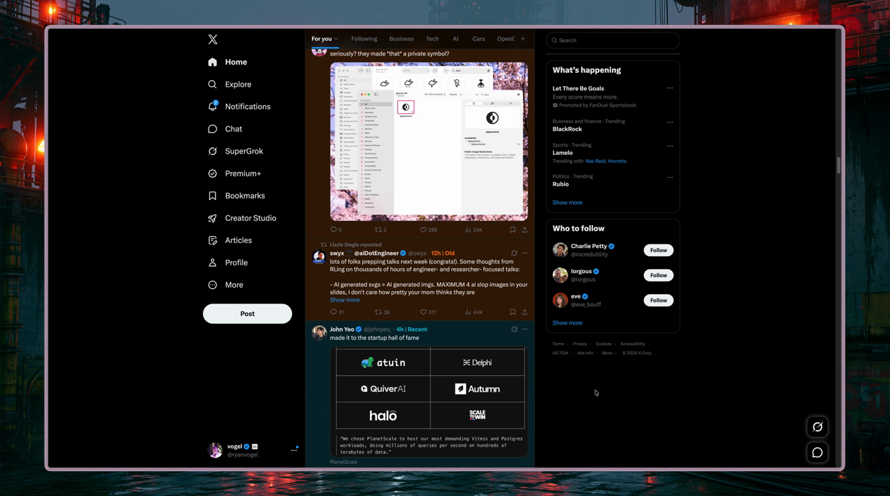

# PostPatina

> See how old the news really is.

PostPatina is a tiny Chrome extension that tints posts on X by age. Fresh posts stay green, older posts warm toward orange and red, and timestamps become easy-to-scan labels such as `20h | Old`.



## Install

1. Download this repository with **Code → Download ZIP**, then unzip it.
2. Open `chrome://extensions` in Chrome.
3. Turn on **Developer mode**.
4. Click **Load unpacked** and choose the unzipped repository folder—the one containing `manifest.json`.
5. Open or refresh [x.com](https://x.com).

That’s it—there is no build step. Click the PostPatina toolbar icon to customize the palette, tint strength, or age cutoffs.

## Default patina

| Post age | Label | Color |
| --- | --- | --- |
| Under 1 hour | Fresh | Green |
| 1–6 hours | Recent | Cyan |
| 6–12 hours | Aging | Yellow |
| 12–24 hours | Old | Orange |
| 24+ hours | Stale | Red |

## What it does

- Reads the exact timestamp already included in each X post.
- Keeps up with infinite scrolling and X’s recycled timeline elements.
- Rechecks every minute so open posts age into the correct band.
- Handles timelines, post pages, quoted posts, and reply threads.
- Leaves promoted cards without timestamps alone.

## Privacy

PostPatina makes no network requests, collects no analytics, and never reads post text. Your preferences stay in Chrome’s synced extension storage.

## Test

```sh
node --test tests/age-utils.test.js
```

## License

[MIT](LICENSE)
